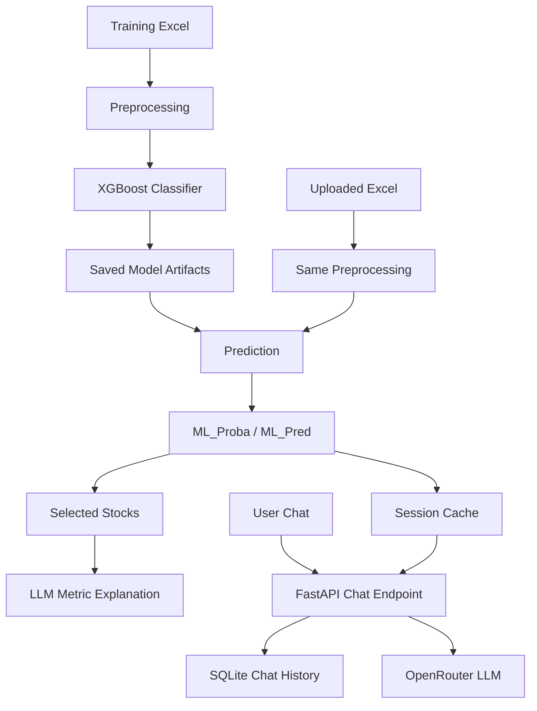

# Financial ML & LLM Analysis Assistant

A FastAPI application combining **financial-statement preprocessing, XGBoost classification, Excel-based inference, LLM-generated explanations, and SQLite-backed conversation history**.

The machine-learning target used by the source code is `Yükselme Tahmini` (rise prediction).

> This project is an experimental decision-support prototype. It is not an automated trading system and does not provide investment advice.

## Architecture



## Features

### Machine Learning

- Automatic model training when artifacts are missing
- Reads training data from Excel
- Converts the target into binary form
- Detects and derives date-related features
- Median imputation for numerical columns
- Most-frequent imputation + one-hot encoding for categorical columns
- Drops high-cardinality non-numeric columns
- Stratified train/test split
- XGBoost binary classifier
- Class-imbalance handling through `scale_pos_weight`
- ROC-AUC, average precision, and classification-report output
- Persists preprocessing and model artifacts

### Inference

- Accepts an uploaded Excel file
- Aligns incoming features with the fitted preprocessing pipeline
- Produces:
  - `ML_Proba`
  - `ML_Pred`
- Selects rows predicted as positive and ranks them by probability

### LLM Layer

- Uses an OpenAI-compatible OpenRouter client
- Generates explanations from selected financial metrics
- Supports continuation calls when a response is cut off because of token length
- Can detect ticker mentions in chat and explain cached data for the mentioned stock

### Conversation Layer

- Stores chat messages in SQLite by `session_id`
- Reloads recent history for later chat turns
- Includes a lightweight browser interface for chat + Excel upload

## Tech Stack

`Python` · `FastAPI` · `pandas` · `scikit-learn` · `XGBoost` · `OpenRouter` · `SQLite` · `HTML` · `JavaScript`

## ML Workflow

```text
Excel training data
        ↓
Target conversion
        ↓
Feature filtering / date features
        ↓
Numerical + categorical preprocessing
        ↓
Stratified train/test split
        ↓
XGBoost training
        ↓
ROC-AUC / Average Precision / Classification Report
        ↓
Saved preprocessor + model
```

## Setup

```powershell
py -3.12 -m venv .venv
.\.venv\Scripts\Activate.ps1
python -m pip install -r requirements.txt
```

Create a local environment file:

```powershell
Copy-Item .env.example .env
```

Important environment variables include:

```text
TRAINING_EXCEL
FORCE_RETRAIN
OPENROUTER_API_KEY
OPENROUTER_MODEL
APP_URL
APP_NAME
```

The training Excel file is **not included** in this repository.

## Usage

Run the application:

```powershell
python app.py
```

The source starts the application on:

```text
http://127.0.0.1:8000
```

Open the browser UI at:

```text
http://127.0.0.1:8000/chat
```

## API Endpoints

### Health

```http
GET /
```

Reports whether model artifacts are available and whether an LLM client is configured.

### Combined chat + Excel inference

```http
POST /chat_combo
```

Accepts:

- `session_id`
- optional Excel file
- optional text prompt

The same endpoint can therefore run spreadsheet inference, chat, or both.

## Project Structure

```text
.
├── app.py
├── .env.example
├── .gitignore
├── requirements.txt
└── README.md
```

Runtime artifacts are written under `out/`, including the trained model, preprocessor, metrics, and SQLite chat database.

## What This Project Demonstrates

- End-to-end tabular ML preprocessing and inference
- Handling class imbalance in binary classification
- Persisting trained ML artifacts
- Combining predictive ML with an LLM explanation layer
- Stateful chat history with SQLite
- Serving ML and LLM functionality through FastAPI
- Building a small browser interface without a separate frontend framework

## Important Interpretation Note

The LLM explanation is generated from selected financial metrics supplied to the language model. It is **not** a feature-attribution explanation of the XGBoost model itself.

In other words, the implementation does not currently use SHAP or another explainability technique to explain the classifier's internal decision.

## Current Limitations

- The training dataset is not included.
- Model quality depends entirely on the supplied training Excel and target definition.
- The uploaded spreadsheet must be compatible with the learned preprocessing schema.
- The LLM explanation layer is separate from model explainability.
- Session dataframes are cached in process memory.
- The browser UI is intentionally minimal.
- No production authentication or authorization layer is included.

## Possible Improvements

- Add SHAP explanations for XGBoost predictions
- Add experiment tracking and model versioning
- Add time-aware validation for financial data
- Add automated schema validation for uploaded spreadsheets
- Add Docker and deployment configuration
- Add unit/integration tests
- Move session cache to an external store for multi-worker deployment
- Add richer visualizations for probabilities and financial metrics

## Background

This project was developed as part of an AI/LLM training program and has been organized as a standalone portfolio project. The original final-project prompt was not included in the available source files, so the documentation describes only functionality supported by the implementation.
